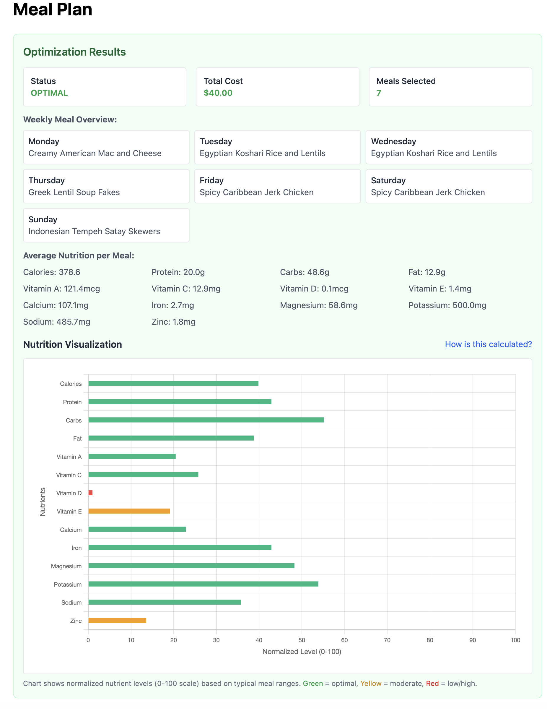

# Meal Lab

**Meal Lab** is a meal planning application that creates weekly meal plans. It takes your dietary requirements and finds meal combinations that meet your nutritional goals while minimizing costs.

## What Does This Do?

Imagine you have a list of 50 different meals, each with different nutritional values and costs. You want to plan 7 meals for the week (one per day) that:
- Meet your specific nutritional requirements (like "I need at least 20g protein per meal")
- Don't exceed your budget
- Don't repeat the same meal too often
- Give you the best value for your money

**Meal Lab** uses linear optimization to solve this problem automatically and find the optimal solution.

## How It Works (The Math)

The application uses **Linear Programming** to solve the meal planning problem. Here's the mathematical formulation:

### Decision Variables
Let $x_{i,j}$ be a binary variable where:
- $x_{i,j} = 1$ if meal $i$ is selected for day $j$
- $x_{i,j} = 0$ if meal $i$ is not selected for day $j$

### Objective Function
**Minimize total cost:**
$$\min \sum_{i=1}^{n} \sum_{j=1}^{7} c_i \cdot x_{i,j}$$

Where $c_i$ is the cost of meal $i$.

### Constraints

**1. Exactly one meal per day:**
$$\sum_{i=1}^{n} x_{i,j} = 1 \quad \forall j \in \{1,2,\ldots,7\}$$

**2. Nutritional requirements (average per meal):**
$$\frac{1}{7} \sum_{i=1}^{n} \sum_{j=1}^{7} n_{i,k} \cdot x_{i,j} \geq N_{k}^{min} \quad \forall k$$
$$\frac{1}{7} \sum_{i=1}^{n} \sum_{j=1}^{7} n_{i,k} \cdot x_{i,j} \leq N_{k}^{max} \quad \forall k$$

Where:
- $n_{i,k}$ = amount of nutrient $k$ in meal $i$
- $N_{k}^{min}$ = minimum required amount of nutrient $k$ per meal
- $N_{k}^{max}$ = maximum allowed amount of nutrient $k$ per meal

**3. Meal frequency limit:**
$$\sum_{j=1}^{7} x_{i,j} \leq F \quad \forall i$$

Where $F$ is the maximum number of times a meal can appear in the week.

**4. Binary constraints:**
$$x_{i,j} \in \{0,1\} \quad \forall i,j$$

## Features

- **Meal Selection**: Uses linear optimization to find optimal meal combinations
- **Nutritional Analysis**: Ensures meals meet macro and micronutrient requirements
- **Cost Optimization**: Minimizes total weekly meal costs
- **User Ratings**: Rate meals based on preferences
- **Visual Analytics**: Displays nutritional breakdowns with interactive charts
- **Flexible Constraints**: Set meal frequency limits and nutritional bounds

## Getting Started

### Prerequisites
- Python 3.8 or higher
- A web browser

### Step 1: Download the Code
```bash
git clone https://github.com/kuangxu/meal_lab.git
cd meal_lab
```

### Step 2: Set Up Python Environment
Create a virtual environment (this keeps the project's dependencies separate from your system):

```bash
# Create virtual environment
python3 -m venv venv

# Activate it (choose the command for your system)
# On Mac/Linux:
source venv/bin/activate
# On Windows:
venv\Scripts\activate
```

You'll know it's working when you see `(venv)` at the beginning of your command prompt.

### Step 3: Install Required Packages
```bash
pip install -r requirements.txt
```

This installs all the necessary Python libraries (Flask, PuLP, etc.).

### Step 4: Run the Application
```bash
python app.py
```

You should see output like:
```
* Running on http://127.0.0.1:5001
* Debug mode: on
```

### Step 5: Open in Your Browser
Open your web browser and go to: **http://localhost:5001**

## Sample Output

Here's an example of a meal plan generated by Meal Lab:



## How to Use

1. **Set Your Requirements**: 
   - Choose a nutritional profile (Healthy Adult, Weight Loss, etc.) or set custom values
   - Specify minimum and maximum amounts for calories, protein, carbs, fat, and vitamins

2. **Choose Optimization Goal**:
   - **Minimize Cost**: Find the cheapest meals that meet your requirements
   - **Maximize Rating**: Find the highest-rated meals that meet your requirements

3. **Set Meal Frequency**: Choose how many times the same meal can appear in your week

4. **Generate Your Plan**: Click "Create Meal Plan" to generate the optimized meal plan.

5. **Review Results**: 
   - See your weekly meal schedule
   - Check nutritional analysis
   - View cost breakdown
   - Explore the nutrition visualization chart

## Adding Your Own Meals

To add your own meals to the database, simply edit the `data/meals.json` file. Each meal should follow this structure:

```json
{
  "title": "Your Meal Name",
  "description": "Brief description of your meal",
  "estimated_cost_usd": 12.50,
  "calories": 400,
  "macros": {
    "protein": 25,
    "carbs": 45,
    "fat": 15
  },
  "micros": {
    "vitamin_a_mcg": 300,
    "vitamin_c_mg": 20,
    "vitamin_d_mcg": 2,
    "vitamin_e_mg": 3,
    "calcium_mg": 250,
    "iron_mg": 3,
    "magnesium_mg": 50,
    "potassium_mg": 400,
    "sodium_mg": 600,
    "zinc_mg": 2
  },
  "user_rating": 5
}
```

**Tips for adding meals:**
- Use nutritional databases like USDA FoodData Central for accurate values
- Estimate costs based on local grocery prices
- Set `user_rating` to 5 as default (you can change it later in the app)
- Make sure all nutritional fields are included (use 0 for missing values)

After adding your meals, restart the application to see them in the meal selection!

## Rate Your Meals

Visit the "Rate Meals" page to:
- Rate meals from 1-10 based on your preferences
- Sort meals by rating, price, or nutritional content
- Reset all ratings back to default

## Technical Details

### Built With
- **Backend**: Python Flask (web framework)
- **Optimization**: PuLP (Python linear programming library)
- **Frontend**: HTML, CSS (Tailwind), JavaScript
- **Charts**: Chart.js for data visualization

### File Structure
```
meal_lab/
├── data/                    # Data files
│   ├── meals.json          # Meal database
│   ├── nutritional_profiles.json  # Predefined profiles
│   └── config.json         # App configuration
├── src/                    # Core logic
│   └── meal_optimizer.py   # Optimization engine
├── templates/              # Web pages
│   ├── index.html         # Main page
│   └── ratings.html       # Rating page
├── app.py                 # Main application
└── requirements.txt       # Python dependencies
```

## Troubleshooting

**"Command not found: python3"**
- Try `python` instead of `python3`
- Make sure Python is installed: https://python.org

**"Module not found" errors**
- Make sure you activated the virtual environment
- Run `pip install -r requirements.txt` again

**App won't start**
- Check if port 5001 is already in use
- Try a different port by editing `app.py`

**Browser shows "This site can't be reached"**
- Make sure the app is running (you should see output in terminal)
- Try `http://127.0.0.1:5001` instead of `localhost:5001`

## Contributing

Submit issues, feature requests, or pull requests via GitHub.

## License

© 2025 Kuang Xu. All rights reserved.

---